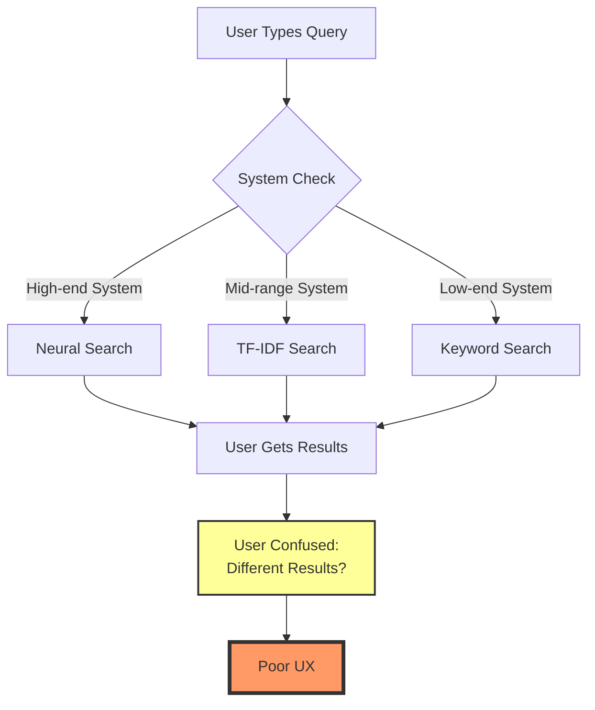

# SemiSearch Project Assessment

**Date:** June 2025
**Assessor:** External Review
**Project Version:** v0.6.0

## Executive Summary

SemiSearch claims to be a "production-ready" semantic search CLI tool after 8 weeks of development. While technically complete with all planned features implemented, the project suffers from significant usability issues that would alienate its target audience of "developers, researchers, and knowledge workers." The tool is **technically impressive but experientially overwhelming**.

## Project State vs. Architecture Plan

### ✅ What's Been Delivered

According to the architecture plan timeline, **all major milestones have been completed**:

- **Week 1-2 Foundation:** CLI interface, configuration management ✓
- **Week 3-4 Storage & Processing:** SQLite database, text processing ✓
- **Week 5-6 ML Integration:** ONNX runtime, embeddings, vector search ✓
- **Week 7-8 Polish:** Testing (131 tests), documentation, packaging ✓

### 📊 Implementation Status

| Component | Planned | Implemented | Lines of Code |
|-----------|---------|-------------|---------------|
| CLI Interface | ✓ | ✓ | 605 (main.rs) |
| Search Strategies | 6 types | 6 types | ~3,200 total |
| Embedder | ✓ | ✓ | 1,255 |
| Indexer | ✓ | ✓ | 526 |
| Database | ✓ | ✓ | In storage/ |
| Tests | Comprehensive | 131 tests | Multiple files |

### 🤔 Skeptical Observations

1. **Timeline Too Aggressive:** 8 weeks from zero to "production-ready" ML-powered search? This suggests either:
   - Significant pre-existing code/experience
   - "Production-ready" is overstated
   - Quality corners were cut

2. **Complexity Creep:** The tool has grown far beyond the "simple, privacy-first search" pitch:
   - 16+ command-line flags for search alone
   - 6 different search modes
   - Complex fallback behaviors

## Critical Usability Concerns

### 1. The "Jim Carrey Problem" 🎬

Both README and architecture docs use this example:
```bash
semisearch search "Jim Carrey"
# Returns: "Ace Ventura: Pet Detective"
```

**Why this is terrible:**
- Requires cultural knowledge (knowing Jim Carrey's filmography)
- Not a realistic use case
- Doesn't demonstrate practical value
- Makes the tool seem like a toy

### 2. Mode Paralysis 🤯

```bash
--mode semantic
--mode keyword
--mode fuzzy
--mode regex
--mode tfidf
--mode hybrid
--mode auto
```

**Problems:**
- Non-technical users won't understand these options
- Even developers will struggle choosing between "semantic" vs "tfidf" vs "hybrid"
- The "auto" mode better be perfect or users will be confused

### 3. Technical Jargon Overload 📚

Error messages expose implementation details:
- "Neural embeddings unavailable"
- "ONNX Runtime not found"
- "Falling back to TF-IDF mode"

**User reaction:** "Is my tool broken? What's ONNX? What's TF-IDF?"

### 4. Score Threshold Confusion 🎯

```bash
--score 0.7  # What does this mean?
--semantic-threshold 0.3  # Even more confusing
```

Users must understand:
- Similarity scores
- Threshold concepts
- Float values between 0-1
- Why different thresholds exist

### 5. Inconsistent Experience 💻

The progressive enhancement means:
- Same search gives different results on different computers
- No clear indication of which mode is active
- Users blame the tool for inconsistency

## System Capability Confusion



## Technical Architecture Assessment

### ✅ The Good

1. **Modular Design:** Clean separation of search strategies
2. **Progressive Enhancement:** Actually works as designed
3. **Async Architecture:** Good foundation for performance
4. **Type Safety:** Rust's type system well-utilized
5. **Test Coverage:** Comprehensive testing approach

### ❌ The Concerning

1. **Over-Engineering:**
   - 6 search modes is 4 too many
   - Complex trait hierarchies for "simple" search
   - Feature flags that most users won't understand

2. **Leaky Abstractions:**
   - ML details exposed to users
   - Technical errors bubbled up
   - Configuration requires understanding internals

3. **Binary Size Concerns:**
   - No mention of final binary size
   - ONNX runtime + dependencies = large executable?
   - "Works on Raspberry Pi" claim needs verification

## Bonus Features (Minimal Implementation Required)

### 1. Smart Defaults Based on File Types
```bash
semisearch "error handling" --in code
# Auto-configures for source code search
```

### 2. Interactive Mode for Beginners
```bash
semisearch --interactive
> What are you looking for?
> What kind of files?
> How exact should matches be?
```

### 3. Visual Similarity Indicators
```
main.rs:45: ████████░░ highly relevant
utils.rs:23: ████░░░░░░ somewhat related
```

### 4. Search Templates
```bash
semisearch template todos     # Find all TODO/FIXME
semisearch template functions # Find function definitions
```

### 5. Natural Language Aliases
```bash
semisearch find "database"
semisearch looking-for "authentication"
semisearch where-is "config"
```

### 6. Progressive Results
```bash
semisearch "query" --stream
# Shows results as found, not after complete search
```

### 7. Confidence Indicators
Replace numeric scores with stars:
```
⭐⭐⭐⭐⭐ Exact match
⭐⭐⭐☆☆ Probably related
⭐☆☆☆☆ Might be relevant
```

### 8. "Did You Mean?" Suggestions
```bash
semisearch "autentication"
> No results. Did you mean "authentication"?
```

### 9. Smart Context Detection
- Auto-respect .gitignore in git repos
- Show git blame info when relevant
- Link to GitHub/GitLab URLs

### 10. Search History & Learning
```bash
semisearch --recent        # Show recent searches
semisearch --popular       # Show common searches in this project
```

## Recommendations for Improvement

### 🎯 Priority 1: Simplify the Default Experience

1. **Hide complexity by default:**
   ```bash
   semisearch "query"  # Should just work
   semisearch "query" --advanced  # Show all options
   ```

2. **Better error messages:**
   - ❌ "Neural embeddings unavailable"
   - ✅ "Using fast search mode"

3. **Remove jargon:**
   - ❌ "TF-IDF search activated"
   - ✅ "Smart ranking enabled"

### 🎯 Priority 2: Fix the Examples

Replace theoretical examples with practical ones:
```bash
# For developers
semisearch "TODO"                    # Find all TODOs
semisearch "database connection"     # Find DB code
semisearch "error handling"          # Find try/catch blocks

# For researchers
semisearch "methodology"             # Find methods sections
semisearch "citation needed"         # Find unsourced claims

# For writers
semisearch "chapter draft"           # Find draft sections
semisearch "needs revision"          # Find revision notes
```

### 🎯 Priority 3: Consistent Experience

1. **Clear mode indicators:**
   ```
   🧠 Using AI-powered search (best quality)
   📊 Using statistical search (good quality)
   🔤 Using keyword search (fast & exact)
   ```

2. **Explain differences:**
   ```
   💡 Tip: Install semisearch-models for better results
   💡 Tip: This computer supports advanced search
   ```

### 🎯 Priority 4: Progressive Disclosure

Start simple, reveal complexity gradually:
```bash
# Beginner
semisearch "error"

# Intermediate
semisearch "error" --fuzzy

# Advanced
semisearch "error" --mode semantic --threshold 0.8 --context 3
```

## Bottom Line

SemiSearch is a **technically competent implementation** that needs serious UX work. It feels like a tool built by backend engineers who rarely interact with normal users. The progressive enhancement is clever but confusing. The feature set is comprehensive but overwhelming.

### The Harsh Truth

This tool is trying to be too clever. It exposes implementation details that users don't care about and offers options they don't understand. For a tool claiming to help users "find what they're looking for even when they don't know the exact words," it sure requires knowing a lot of exact technical terms to use effectively.

### The Path Forward

1. **Hide the magic:** Users don't need to know about embeddings, ONNX, or TF-IDF
2. **Simplify the interface:** 3-4 options max for normal users
3. **Better examples:** Show real-world use cases, not movie trivia
4. **Consistent experience:** Same query should give similar results everywhere
5. **Progressive disclosure:** Advanced features behind --advanced flag

The foundation is solid. The implementation is complete. Now it needs a UX designer who's never heard of "neural embeddings" to make it actually usable by its target audience.

## What "Should Just Work" Actually Means

The phrase "should just work" is developer-speak that avoids making hard UX decisions. Here's what it actually means in concrete terms:

### Current Reality (v0.6.0)
```bash
# User must make 16+ decisions before searching
semisearch search "error handling" \
  --path ./src \
  --mode auto \
  --score 0.3 \
  --semantic-threshold 0.7 \
  --limit 10 \
  --format plain \
  --context 2

# Output exposes technical details
⚠️  Semantic search unavailable: ONNX Runtime not found
🔄 Falling back to TF-IDF mode
Found 15 matches in 245ms:
📁 src/main.rs
   Line 42: catch(error) { handleError(error); }
   Score: 0.847
   Match: Hybrid
```

### What Users Actually Want
```bash
# Zero configuration required
semisearch "error handling"

# Output focuses on results, not technical details
Found 15 matches:

src/main.rs:42
    catch(error) { handleError(error); }

src/utils.rs:18
    try { validateInput() } catch(e) { ... }

lib/validator.js:5
    throw new ValidationError("Invalid input");
```

### The Three-Tier Approach

#### Tier 1: Beginner (90% of users)
```bash
semisearch "query"                    # Everything is automatic
semisearch "query" --exact            # Exact matches only
semisearch "query" --fuzzy            # Allow typos
```

**Behind the scenes:**
- Auto-detects file types and adjusts strategy
- Uses best available search method without mentioning it
- Limits results to most relevant (top 10)
- Never mentions "embeddings," "TF-IDF," or "ONNX"

#### Tier 2: Intermediate (9% of users)
```bash
semisearch "query" --in code          # Search only code files
semisearch "query" --in docs          # Search only documentation
semisearch "query" --recent           # Search recently modified files
semisearch "query" --more             # Show 50 results instead of 10
```

**Behind the scenes:**
- File type filtering uses smart defaults (.rs, .py, .js for code)
- Still hides technical implementation details
- Provides more control without requiring technical knowledge

#### Tier 3: Advanced (1% of users)
```bash
semisearch "query" --advanced         # Unlocks all current options
```

**This reveals the current interface:**
- All 16+ flags become available
- Technical error messages are shown
- Scores and match types are displayed

### Making Smart Defaults Work

Instead of asking users to choose between 6 modes, make intelligent decisions:

#### File Type Detection
```bash
# User runs: semisearch "TODO"
# Tool detects: This is a code project (sees Cargo.toml)
# Auto-configures: Search .rs, .py, .js files with regex mode
# Shows: "Searching code files for TODO comments..."
```

#### Query Analysis
```bash
# User searches: "function validateUser"
# Tool detects: Specific function name pattern
# Auto-configures: Exact matching + fuzzy for typos
# Shows: "Looking for function definitions..."

# User searches: "user authentication concepts"
# Tool detects: Conceptual query (multiple abstract terms)
# Auto-configures: Semantic search if available, TF-IDF if not
# Shows: "Searching for related concepts..."
```

#### Context-Aware Behavior
```bash
# In git repo: Automatically respects .gitignore
# In docs folder: Prioritizes .md, .txt, .rst files
# In src folder: Prioritizes code files, shows function signatures
# Large project: Automatically creates index for speed
```

### Error Messages That Don't Suck

#### Current (Terrible)
```
⚠️  Neural embeddings unavailable: ONNX Runtime not found
🔄 Falling back to TF-IDF mode
Error: Minimum similarity score must be between 0.0 and 1.0
```

#### Better (User-Focused)
```
🔍 Searching with keyword matching...
💡 Tip: Run 'semisearch setup' for better results

No matches found. Try:
  • Check spelling: semisearch "authenitcation" --fuzzy
  • Broaden search: semisearch "auth"
  • Different terms: semisearch "login OR signin"
```

### The Real Test

A "simplified default experience" means my non-technical friend can:

1. **Install it:** `brew install semisearch` (or whatever)
2. **Use it immediately:** `semisearch "TODO"` finds all TODO comments
3. **Get better at it gradually:** Discovers `--fuzzy` when they misspell something
4. **Never see technical jargon:** No mentions of embeddings, TF-IDF, or ONNX

If they need to read documentation to perform a basic search, the default experience has failed.

---

*Remember: The best technology is invisible to the user. Right now, SemiSearch's technology is uncomfortably visible.*
